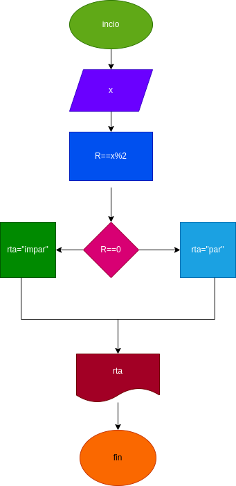

# Ejercico No.4 

## verificar si un numero es par o impar

# ANALISIS

variable de entrada

x: numero a verificar 

variable de proceso salida (processing, storang, output)

rta: resultado de la verificacion numero par o impar

# DISEÑO

# CONSTRCCION